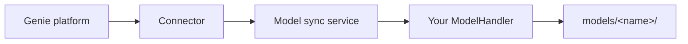

# Model handling

[Models](models.md) store per-system checkpoints and metadata under the models directory of an agent. During an optimization run, your agent loads weights from `<model-name>/models/` via `load_models`. **Model handling** covers everything beyond that day-to-day loop: cloning a model for a new circuit, exporting artifacts off the platform, and importing them back.

The ADK delegates those operations to a [`ModelHandler`](../API/model-handler.md) class you provide. When the platform requests a transfer, export, or import, the connected agent process routes the call to your static methods through the model sync service.

:::caution
Do not directly modify a model directory on the filesystem while an optimization is running for that model. ADK-managed model operations coordinate through per-model locks, but external filesystem changes are the user's responsibility. Editing or replacing spec files or checkpoint files under `<models-directory>/<model-name>/` during training or inference may invalidate or corrupt the running model.
:::

## When to implement ModelHandler

Implement [`ModelHandler`](../API/model-handler.md) if users should be able to:

- **Transfer** — create a new model from an existing one with updated hyper-parameters, target specifications, or world controls, while reusing learned weights where possible
- **Export** — download a signed archive of model metadata and checkpoint files
- **Import** — restore an exported archive into a new local model directory

If you omit `model_handler` on [`Connector`](../API/connector.md), transfer, export, and import routes fail when the platform invokes them. Training and inference still work as long as models exist on disk.

## Wiring

For RL agents, it is recommended to implement `ModelHandler` on the same class as [`RLAgentEnv`](../API/rl-agent-env.md) and pass it twice to the connector:

```py
from adk.connector import Connector
from adk.executors.rl import RLExecutor
from adk.model_handler import ModelHandler

class MyAgent(RLAgentEnv, ModelHandler):
    ...

app = Connector(
    RLExecutor,
    rl_agent_env_class=MyAgent,
    model_handler=MyAgent,
)
app.start()
```

If you are usting a custom executor, you can pass the handler class to the connector as `model_handler`.

## Platform operations



| Operation | What the ADK does | Your handler's job |
|-----------|-------------------|-------------------|
| **Transfer** | Copies the source model directory, applies new metadata from the platform, then calls your transfer methods | Adapt `nn_arch`, `specifics`, and checkpoint files for the destination specifications |
| **Export** | Builds a zip of JSON metadata plus a signed `model_files.bin` blob | `serialize_models` — pack files under `models/<name>/models/` into bytes |
| **Import** | Verifies the signature, writes JSON files, creates `models/<name>/models/` | `deserialize_models` — unpack bytes into the model directory |

### Transfer

A transfer starts from a **parent** model and produces a **new** model with a different name, description, visibility, hyper-parameters, [model target specifications](../API/Models/target-specifications.md), and [world control specifications](../API/Models/world-control-specifications.md).

The ADK performs these steps:

1. Copy `models/<parent_name>/` to `models/<new_name>/`
2. Update metadata and specification JSON files from the platform payload (`TransferModel`: parent name, new name, description, hyper-parameters, target specs, world controls, visibility)
3. Call `transfer_nn_arch`, `transfer_specifics`, and `transfer_models` on your handler
4. Write the updated model back to disk and register it with the platform

Use `transfer_nn_arch` when observation or action dimensions change and the stored architecture dict must be updated. Use `transfer_specifics` to adjust agent-defined fields in `metadata.json` (for example, dropping reward-scaling factors when target specs differ). Use `transfer_models` to load source checkpoints, reshape or reinitialize layers as needed, and write files into the destination `models/` subdirectory.

If any handler method raises `NotImplementedError`, the ADK rolls back the copied directory.

### Export and import

Export collects the four specification JSON files plus whatever checkpoint files your `serialize_models` includes. Import reverses the process after signature verification. You control which files are packed — typically the same set your agent reads in `save_models` / `load_models`.

## Implementing the methods

All [`ModelHandler`](../API/model-handler.md) methods are `@staticmethod`s. Each receives enough context to map from the source model to the destination:

- `from_genie_model` — the parent model before changes
- `transfer_data` — the destination name, description, hyper-parameters, and specifications from the platform
- `from_model_path` / `to_model_path` — `Path` objects pointing at `models/<name>/models/`

A production reference implementation is `SACAgent` in the SAC-AQ-V3 agent: it keeps the NN architecture unchanged, prunes incompatible `specifics`, resizes actor/critic input and output heads when world controls or targets change, and writes fresh scalers, stats, and replay buffers for the new model.

See the [ModelHandler API reference](../API/model-handler.md) for method signatures.

## Related pages

| Topic | Page |
|-------|------|
| Model directory layout | [Models](models.md) |
| Checkpoints during optimization | [Optimization loop](optimization-loop.md) |
| Agent wiring | [Agents](agents.md) |
| Full API | [`ModelHandler`](../API/model-handler.md) |
