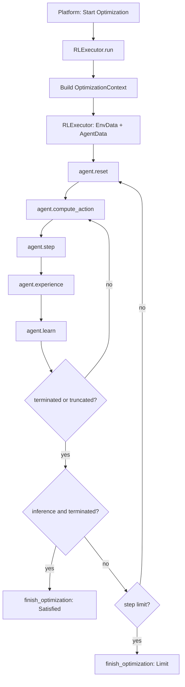

# Optimization loop

Every optimization run eventually loops until stopped, a limit is reached, or (in inference) targets
are satisfied. **How** that loop is implemented depends on your executor.

This page describes the loop implemented by [`RLExecutor`](../API/rl-executor.md) — the stock RL
executor that `genie setup` scaffolds. It is not the only way to optimize with the ADK; custom
[`BaseExecutor`](../API/base-executor.md) subclasses implement their own `run()` logic, usually via
[`OptimizationContext`](../API/optimization-context.md). See [RL Agents](rl-agents.md) and
[What To Do Next](../what-to-do-next.md).

## When the loop ends

Regardless of executor, a run stops when one of the following happens:

1. A training run reaches its step limit or is stopped from the platform.
2. An inference run satisfies all targets (`terminated`) or reaches its step limit.
3. The user clicks **Stop Optimization** in the Genie UI.

The loop is started from the web interface (**Genie Optimize** in a project) while your agent process
is connected (`genie run`).

## RLExecutor flow

When you pass `RLExecutor` to the [`Connector`](../API/connector.md), each optimization run follows
this sequence:

1. **Load context** — [`BaseExecutor.build_optimization_context()`](../API/base-executor.md) resolves design parameters, targets, and default observations from the platform spec. This step is shared with all executors.
2. **Construct RL run data** — `RLExecutor` maps that context into [`EnvData`](rl-run-data.md#envdata) and [`AgentData`](rl-run-data.md#agentdata), then instantiates your [`RLAgentEnv`](../API/rl-agent-env.md) subclass. Saved weights are loaded from `models/<genie-model>/models/`.
3. **Episode loop** — `RLExecutor` repeats until the run stops:
   - `reset()` → initial `observation`, `info`
   - **Step loop** until `terminated` or `truncated`:
     - `compute_action(observation, info)` → `action`
     - `step(action)` → `next_observation`, `reward`, `terminated`, `truncated`, `next_info`
     - `experience(...)` — record the transition
     - `learn()` — update the agent (training mode)
     - Update platform display via `update_display`
     - On episode end: increment episode counter; in **training**, save models every 100 episodes
     - In **inference**, if `terminated`, finish with "all targets satisfied"
   - Respect [`RLExecutorConfig`](../API/rl-executor.md) limits (`maximum_training_steps`, `maximum_inference_steps`)

## Custom executors

If you subclass [`BaseExecutor`](../API/base-executor.md), you implement `run()` yourself. Use
[`OptimizationContext`](../API/optimization-context.md) to read parameters and targets, call
`ctx.step_world(...)`, push progress with `ctx.update_display(...)`, and end with
`ctx.finish_optimization(...)`. Loop until `ctx.is_stop_requested()` is true. There is no
`EnvData`, `AgentData`, or Gymnasium episode/step cycle unless you add that wiring yourself.

See [RL Agents](rl-agents.md) and [Agents](agents.md) for when to choose `RLExecutor` vs a custom executor.
