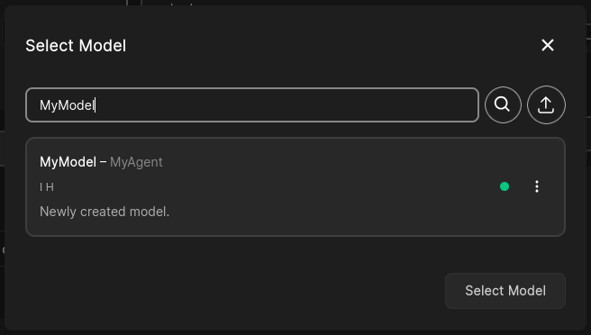
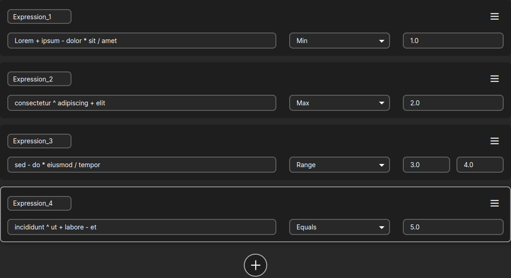

# Running on the Cloud
After following the [quick start](getting-started#quick-start), you should now have an agent up on the platform,
you can see this if you click on the model selection dialogue in the **Genie** tab of any project and search for your model:



Select your model in the selection dialogue and define some valid expressions e.g.:


And **start the optimization** with:


If you come back to the console where you started the agent, you will see episode and step logs from
[`RLExecutor`](API/rl-executor.md), for example:
```sh
yyyy-mm-dd hh:mm:ss,ms - INFO:     Episode: 1
yyyy-mm-dd hh:mm:ss,ms - INFO:     	Ended by: Truncation
yyyy-mm-dd hh:mm:ss,ms - INFO:     	Steps taken: 1
yyyy-mm-dd hh:mm:ss,ms - INFO:     	Total reward: -12.5
yyyy-mm-dd hh:mm:ss,ms - INFO:     	Total steps taken: 1

yyyy-mm-dd hh:mm:ss,ms - INFO:     Episode: 2
yyyy-mm-dd hh:mm:ss,ms - INFO:     	Ended by: Truncation
...
```

Congratulations! You have successfully started an optimization. You can stop it at any time by hitting the
`Stop Optimization` button that appeared in place of the `Genie Optimize` button.

Next, see [What To Do Next](what-to-do-next.md) for a high-level map of customizing agents, executors, and RL environments.