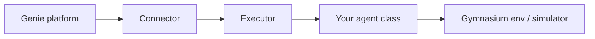

# What To Do Next

Now that you have an agent connected to the platform, this page is a high-level map for customizing **what** your agent does and **how** each optimization run is executed.

## How the pieces fit together

When the platform starts an optimization, your process receives the job through the [`Connector`](API/connector.md), which instantiates an **executor** you pass in and calls `run()`. That is the core contract; kwargs forwarded from `Connector` are defined by whichever executor you choose — they may differ widely, or be absent beyond the [`BaseExecutor`](API/base-executor.md) defaults.

The stock [`RLExecutor`](API/rl-executor.md) (also what `genie setup` scaffolds) is a convenience for RL: it runs the standard loop for you and asks for an `RLAgentEnv` subclass that implements Gymnasium stepping. The agent / environment split in templates follows from that choice, not from the ADK itself. For other optimization methods, subclass `BaseExecutor` and implement `run()` directly — often via [`OptimizationContext`](API/optimization-context.md).



| Piece | Your code | Default |
|-------|-----------|---------|
| Entry point | `src/main.py` | Wires `Connector` + executor |
| Executor | Optional custom subclass | [`RLExecutor`](API/rl-executor.md) |
| Agent / optimizer | `RLAgentEnv` subclass or logic inside `BaseExecutor` | Template in `src/agent.py` |
| Environment | Built-in env ID or custom [`OptimizationEnv`](API/Environments/optimization-env.md) | Often `AI4EE-Direct-Action-Env` |

Most projects only replace `src/agent.py` and keep the stock `RLExecutor` entry point.

## Choose your path

### Reinforcement learning (most common)

Subclass [`RLAgentEnv`](API/rl-agent-env.md) and implement both:

- [`AgentInterface`](API/agent-interface.md) — `compute_action`, `experience`, `learn`, `save_models`, `load_models`
- [Gymnasium](https://gymnasium.farama.org/) — `reset`, `step`, `observation_space`, `action_space`, …

Wire it in `src/main.py`:

```py
from adk.connector import Connector
from adk.executors.rl import RLExecutor
from my_agent import MyAgent

app = Connector(
    RLExecutor,
    rl_agent_env_class=MyAgent,
    model_handler=MyAgent,  # required if the agent supports model transfer / export / import
)
app.start()
```

**Start here:** [RL Agents](Basics/rl-agents.md), [Environments](Basics/environments.md), [`RLExecutor`](API/rl-executor.md)

### Custom executor (non-RL or full control)

Subclass [`BaseExecutor`](API/base-executor.md) and implement `run()` yourself. Use [`OptimizationContext`](API/optimization-context.md) to read design parameters and targets, call `ctx.step_world(...)`, report progress with `ctx.update_display(...)`, and finish with `ctx.finish_optimization(...)`.

```py
from adk.connector import Connector
from adk.base_executor import BaseExecutor

class MyOptimizerExecutor(BaseExecutor):
    def run(self) -> None:
        ctx = self.build_optimization_context()
        while not ctx.is_stop_requested():
            # your optimization logic
            pass

app = Connector(MyOptimizerExecutor)
app.start()
```

Use this path for heuristics, evolutionary methods, Bayesian optimization, or any loop that does not map cleanly onto the RL episode/step API.

**Start here:** [`BaseExecutor`](API/base-executor.md), [`OptimizationContext`](API/optimization-context.md), [Agents](Basics/agents.md) (custom executor section)

### Environments and simulator interaction

RL agents usually hold a Gymnasium env (for example a [built-in ADK environment](Basics/environments.md)) that translates actions into simulator steps. You can use a stock env ID, subclass [`OptimizationEnv`](API/Environments/optimization-env.md), or implement stepping directly on your `RLAgentEnv` — but the Gymnasium interface on your agent class is still required when using `RLExecutor`. With a custom executor, use [`OptimizationContext`](API/optimization-context.md) instead.

**Start here:** [RL Agents](Basics/rl-agents.md), [Environments](Basics/environments.md), [Specifications](Basics/specifications.md), [RL run data](Basics/rl-run-data.md)

## What happens during a run

Regardless of path, an optimization run loads context from the platform (design parameters, targets, observations), loops until stopped or a limit is reached, and streams progress back to Genie.

[`RLExecutor`](API/rl-executor.md) implements the usual RL cycle — episodes, `reset` / `step` / `learn`, checkpoint saves. See [Optimization loop](Basics/optimization-loop.md) for the step-by-step breakdown.

## Models, checkpoints, and model handling

Models are how one agent implementation serves many circuits or systems: weights and per-system metadata live under `models/<name>/`. The executor loads checkpoints from `models/<genie-model>/models/` at run time; changes sync to the platform while the agent is running.

| Task | Where to look |
|------|----------------|
| Add or configure a model | [Getting Started](getting-started.md#create-a-new-model), [Models](Basics/models.md) |
| Day-to-day `genie model` commands | [Models](Basics/models.md), `genie model -h` |
| Transfer, export, or import between models | [Model handling](Basics/model-handling.md), [`ModelHandler`](API/model-handler.md) |

## Quick reference

| Goal | Start here |
|------|------------|
| Implement an RL agent | [RL Agents](Basics/rl-agents.md), [`RLAgentEnv`](API/rl-agent-env.md), and [`AgentInterface`](API/agent-interface.md) |
| Understand the RL run loop | [Optimization loop](Basics/optimization-loop.md) and [`RLExecutor`](API/rl-executor.md) |
| Use or extend a Gymnasium environment | [Environments](Basics/environments.md) and [`OptimizationEnv`](API/Environments/optimization-env.md) |
| Custom (non-RL) optimization logic | [`BaseExecutor`](API/base-executor.md) and [`OptimizationContext`](API/optimization-context.md) |
| Agent project layout and settings | [Agents](Basics/agents.md) |
| End-to-end walkthrough | [Getting Started](getting-started.md) and this page |
